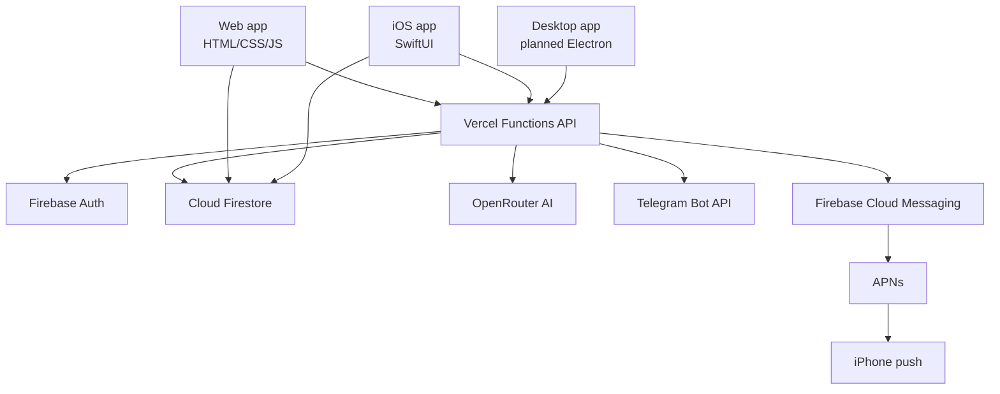

# HoldingMan: продукт, функции и техническая архитектура

Дата фиксации: 10.07.2026

## 1. Что такое HoldingMan

HoldingMan - это система управления проектами, задачами, сроками и ответственными для холдингов, девелоперских групп, проектных офисов и команд, где важно видеть не просто список поручений, а состояние работ по каждому проекту.

Ключевая идея продукта:

> Проекты, задачи и сроки холдинга под контролем.

HoldingMan сфокусирован на практическом управлении:

- проекты;
- задачи;
- ответственные;
- сроки;
- статусы выполнения;
- контроль просрочек;
- уведомления;
- роли и доступы;
- файлы проекта;
- ИИ-агент, который понимает контекст проектов и помогает работать с задачами.

Продукт не строится как перегруженная CRM. Основной фокус - проектное управление, контроль исполнения и простота ежедневной работы.

## 2. Позиционирование продукта

HoldingMan закрывает потребность компаний, которым нужна более простая и сфокусированная система, чем Bitrix24 и похожие универсальные CRM.

Основные отличия:

- меньше лишних разделов и шума;
- фокус на проектах, задачах, сроках и исполнителях;
- структура удобна для холдинга и нескольких проектных направлений;
- ИИ-агент встроен в рабочий процесс, а не является отдельным чат-ботом;
- цена подписки должна быть ниже крупных CRM;
- интерфейс рассчитан на ежедневное использование сотрудниками без долгого обучения.

Целевая аудитория:

- холдинги;
- девелоперские компании;
- проектные офисы;
- управляющие компании;
- строительные и инвестиционные команды;
- собственники и постановщики, которым нужен контроль задач по нескольким проектам.

## 3. Текущий состав продукта

На текущий момент продукт состоит из нескольких частей:

- веб-приложение HoldingMan;
- серверная логика на Vercel Functions;
- Firebase Auth и Firestore;
- ИИ-агент через серверный API;
- Telegram-интеграция;
- iOS-приложение на SwiftUI;
- push-уведомления на iPhone через FCM/APNs;
- проектная документация и планы развития;
- landing-страница продукта в репозитории.

Текущий production-адрес веб-приложения:

- `https://projectmanteko.vercel.app/`

## 4. Основные сущности системы

### Организация

Организация - изолированное рабочее пространство компании или команды.

Внутри организации находятся:

- пользователи;
- проекты;
- задачи;
- роли;
- уведомления;
- файлы проектов;
- настройки доступа;
- история критических действий.

Данные организаций должны быть изолированы друг от друга. Пользователь одной организации не должен видеть проекты, задачи, файлы, уведомления и данные другой организации.

### Пользователь

Пользователь входит через Firebase Auth. Дополнительно поддерживается вход через Telegram-бота.

У пользователя есть:

- UID Firebase;
- имя;
- организация;
- роль;
- доступные проекты;
- Telegram-привязка, если включена;
- устройства для push-уведомлений;
- статистика и XP.

### Роли

В системе используются 4 роли:

- владелец;
- администратор;
- модератор;
- исполнитель.

Роль "наблюдатель" не является частью текущей ролевой модели HoldingMan.

Общий смысл ролей:

- владелец - полный контроль над организацией;
- администратор - управление проектами, задачами, пользователями и финальным контролем;
- модератор - постановка и контроль задач в рамках доступов;
- исполнитель - работа с назначенными задачами.

### Проект

Проект - основная рабочая единица, внутри которой группируются задачи, файлы, сроки и ответственные.

Примеры проектов из текущей рабочей среды:

- Елисеевский парк;
- Абрау-Дюрсо;
- Каспийский Кластер;
- Лазурный берег.

### Задача

Задача содержит:

- название;
- описание или комментарий;
- проект;
- ответственных;
- постановщика;
- срок;
- статус;
- вложения;
- отчет исполнителя;
- файлы подтверждения;
- историю статуса.

### Статусы задач

Основные статусы:

- назначена;
- в работе;
- на проверке;
- готово.

Логика статусов:

1. Задача создается и назначается ответственному.
2. Исполнитель берет задачу в работу.
3. Исполнитель завершает задачу и отправляет на проверку.
4. Постановщик, администратор или модератор подтверждает выполнение.
5. После подтверждения задача переходит в "готово".

## 5. Функции веб-приложения

### Проекты

Веб-приложение позволяет:

- создавать проекты;
- выбирать проект в боковом меню;
- просматривать задачи проекта;
- открывать Канбан;
- открывать Гант;
- загружать файлы проекта;
- удалять проекты при наличии прав.

### Задачи

Поддерживается:

- создание задач вручную;
- создание задач через ИИ-агента;
- назначение ответственных;
- установка дедлайнов;
- прикрепление файлов;
- смена статуса;
- возврат задачи на доработку;
- подтверждение выполнения;
- удаление задач при наличии прав.

### Канбан

Канбан отображает задачи по статусам:

- назначенные;
- в работе;
- на проверке;
- готово.

В веб-интерфейсе статус "В процессе" должен использоваться как "В работе" для согласованности с остальной системой.

### Гант

Гант используется для отображения задач по срокам и проектному календарю. Задачи без дедлайна не могут корректно участвовать в календарной шкале.

### Мои задачи

Раздел "Мои задачи" показывает задачи, где текущий пользователь назначен ответственным.

В iOS-логике отдельно выделяются:

- назначенные;
- в работе;
- на проверке.

Готовые задачи в рабочем списке "Мои задачи" не должны мешать текущей работе.

### Уведомления

В системе есть раздел уведомлений. Уведомления используются для событий:

- новая задача;
- задача отправлена на проверку;
- задача возвращена на доработку;
- задача просрочена;
- до дедлайна остался 1 день;
- задача не взята в работу;
- системные уведомления агента.

Уведомления существуют в трех каналах:

- внутри приложения;
- Telegram;
- push-уведомления на iPhone.

## 6. ИИ-агент

ИИ-агент - важная часть HoldingMan. Он работает не как отдельная справка, а как рабочий помощник внутри продукта.

Агент должен:

- отвечать только на основе актуальных данных организации;
- видеть проекты, задачи, сроки, пользователей и файлы, доступные текущему пользователю;
- не выдумывать задачи, файлы, функции и статусы;
- не обращаться к себе в третьем лице;
- не говорить "ИИ-агент сделает", потому что он сам и является агентом;
- понимать контекст диалога;
- помнить, о каком проекте идет речь в текущем обсуждении;
- использовать файлы проекта как базу знаний;
- извлекать из файлов возможные задачи;
- предлагать карточку предпросмотра перед созданием или удалением задач;
- выполнять destructive actions только после подтверждения пользователя.

### Что агент умеет

Агент поддерживает:

- ответы по проектам;
- ответы по задачам;
- ответы по срокам;
- ответы по файлам проекта;
- анализ извлеченного текста файлов;
- предложение задач из документов;
- создание задач через карточку подтверждения;
- удаление задач через карточку подтверждения;
- удаление всех задач по условиям пользователя, если это явно подтверждено;
- работу с уведомлениями;
- уточнение неоднозначных запросов.

Примеры запросов:

- "Создай задачу Амирхану по Елисеевскому парку, срок завтра";
- "Какие файлы есть в проектах?";
- "Что внутри файла проекта Каспийский Кластер?";
- "Какие задачи можно вытянуть из файла Лазурный берег?";
- "Удали все назначенные задачи из проекта Елисеевский парк";
- "Удали все задачи из раздела готово в проекте Абрау-Дюрсо";
- "Удали все задачи со всех проектов".

### Как агент создает задачи

Создание задач идет через безопасный сценарий:

1. Пользователь пишет запрос.
2. Сервер определяет намерение создать задачу.
3. Агент формирует предварительную карточку.
4. Пользователь подтверждает.
5. Сервер заново проверяет проект, пользователей, права и payload.
6. Только после проверки задача создается в Firestore.

Клиент не должен считать обычный текстовый ответ `{ ok: true, answer }` успешным созданием задачи. Успех создания должен определяться только фактическим результатом операции создания.

### Как агент удаляет задачи

Удаление задач должно идти зеркально созданию:

1. Пользователь пишет запрос на удаление.
2. Сервер находит задачи по условиям.
3. Агент показывает карточку предпросмотра удаления.
4. Пользователь подтверждает.
5. Сервер повторно проверяет права, организацию, проект и список задач.
6. Только после этого задачи удаляются.

Удаление без карточки подтверждения недопустимо.

### Работа агента с файлами

Файлы проекта проходят извлечение текста. Агент должен использовать `extractedText`, если пользователь спрашивает:

- что внутри файла;
- какие выводы можно сделать;
- какие задачи можно сформировать;
- какие риски есть в документе;
- какие сроки, цифры или показатели указаны.

Если файл загружен и текст извлечен, агент не должен отвечать "откройте файл вручную" вместо анализа. Он должен проанализировать доступное содержимое и дать прикладной ответ.

## 7. Файлы проекта и база знаний

Файлы проекта используются как база знаний для команды и ИИ-агента.

Поддерживаемые типы файлов по серверной логике:

- `.md`;
- `.docx`;
- `.xlsx`;
- `.xlsm`;
- `.pdf`.

Ограничение размера файла:

- до 10 MB.

После загрузки сервер извлекает текст и сохраняет статус извлечения. Агент работает по извлеченному тексту, а не только по имени файла.

Файлы проекта важны для сценариев:

- хранение дорожных карт;
- хранение аналитических справок;
- извлечение задач из документов;
- проверка цифр и сроков;
- быстрые ответы по проекту.

## 8. iOS-приложение

iOS-приложение HoldingMan реализовано как native SwiftUI-приложение.

Технически оно не является WebView-копией сайта. Оно использует тот же backend и ту же базу данных, но интерфейс написан нативно под iOS.

Текущая iOS-архитектура:

- SwiftUI;
- Firebase Auth;
- Firebase Firestore;
- Firebase Messaging;
- Vercel API;
- APNs через Firebase Cloud Messaging;
- общий аккаунт с веб-версией;
- общие организации, проекты, задачи и уведомления.

Bundle ID:

- `com.holdingman.ios`

Минимальная версия iOS:

- iOS 17.0

### Что есть в iOS

В iOS-приложении есть:

- вход по email/password;
- вход через Telegram-бота;
- выбор организации;
- вступление по коду приглашения;
- список проектов;
- фильтр проектов и задач;
- карточки задач;
- создание задач;
- создание проектов;
- мои задачи;
- разделение моих задач на назначенные, в работе и на проверке;
- ИИ-агент;
- предпросмотр создания задач агентом;
- предпросмотр удаления задач агентом;
- уведомления внутри приложения;
- push-уведомления на телефон;
- профиль;
- команда и управление ролями;
- переключение темы;
- работа с вложениями.

### Push-уведомления на iPhone

APNs уже настроен, push-уведомления приходят на iPhone.

Техническая схема:

1. iOS-приложение получает FCM token.
2. Token сохраняется в Firestore в `users/{uid}/devices/{deviceId}`.
3. Сервер создает уведомление в `agentNotifications`.
4. Сервер отправляет push через Firebase Cloud Messaging.
5. FCM доставляет уведомление через APNs на iPhone.

Push-уведомления связаны с теми же событиями, что и уведомления внутри приложения:

- новая задача;
- задача на проверке;
- возврат на доработку;
- просрочка;
- дедлайн скоро;
- задача не взята в работу.

Важно: push-уведомление и уведомление в разделе "Уведомления" должны создаваться из одного серверного события, чтобы не было ситуации, когда push пришел, а внутри приложения записи нет, или наоборот.

### Отличия iOS от веб-версии

iOS-приложение сохраняет тот же аккаунт, данные и бизнес-логику, но интерфейс адаптирован под мобильный UX.

Часть веб-функций может быть не в первой мобильной версии:

- полноценный Гант;
- расширенный просмотр файлов проекта;
- некоторые desktop-ориентированные элементы;
- часть административных экранов.

Это не разные продукты, а разные клиенты одной системы.

## 9. Telegram-интеграция

Telegram используется для:

- входа через Telegram-бота;
- привязки Telegram к пользователю;
- отправки уведомлений о задачах;
- подтверждения Telegram-login flow.

Серверные endpoint'ы:

- `api/telegram-bot-login-start.js`;
- `api/telegram-bot-login-status.js`;
- `api/telegram-auth.js`;
- `api/webhook.js`;
- `api/notify-telegram.js`.

Уведомления через Telegram должны отправляться только пользователю той же организации, к которой относится событие.

## 10. Подписка и коммерческая модель

Подписочная модель запланирована как SaaS-модель для организаций.

Базовая логика:

- платит организация;
- сотрудники входят в организацию;
- стоимость зависит от количества мест;
- владелец или администратор управляет подпиской;
- при неоплате доступ ограничивается на уровне организации.

Планируемая модель:

- цена за сотрудника в месяц;
- trial-период;
- grace-period при проблемах с оплатой;
- управление тарифом;
- счета, чеки, возвраты и юридические документы;
- landing-страница с оплатой и скачиванием приложений.

Пример структуры подписки в Firestore:

```js
organizations/{orgId}.subscription = {
  status: 'trialing' | 'active' | 'past_due' | 'canceled',
  plan: 'team',
  seats: 10,
  pricePerSeat: 390,
  currentPeriodEnd: '<timestamp>',
  paymentMethodId: '<provider-token>'
}
```

Важно: платежная система, юридическая модель, чеки, оферта, политика возвратов и налоги должны быть согласованы до коммерческого запуска.

## 11. Landing и сайт продукта

В репозитории есть landing-страница `landing.html`.

Назначение landing:

- объяснить, что такое HoldingMan;
- показать отличие от перегруженных CRM;
- показать функции;
- дать скачать приложение;
- дать войти в веб-версию;
- показать тарифы;
- подключить оплату подписки;
- разместить юридические документы;
- дать контакт поддержки.

Планируемые страницы:

- главная;
- тарифы;
- скачать для Windows/macOS;
- скачать iOS/Android;
- вход;
- политика конфиденциальности;
- пользовательское соглашение;
- условия оплаты и возврата;
- поддержка.

Текущий контакт поддержки из landing:

- `hello@holdingman.ru`

## 12. Desktop-приложение Windows/macOS

Планируется отдельное desktop-приложение для Windows и macOS.

Цель:

- сотрудник один раз скачивает приложение;
- входит в аккаунт;
- ежедневно работает как в отдельной программе;
- интернет всегда нужен, потому что данные живут в облаке;
- функционал, визуал и поведение должны максимально совпадать с веб-версией.

Предпочтительная техническая модель:

- Electron-приложение;
- загрузка production web app;
- единый backend;
- единая база;
- единые аккаунты;
- автообновление;
- code signing;
- notarization для macOS;
- installer для Windows.

Desktop-приложение не должно иметь отдельную локальную базу задач. Оно должно работать как клиент к общей системе.

## 13. Android-приложение

Android-приложение запланировано как отдельный мобильный клиент.

Оно должно использовать:

- тот же Firebase Auth;
- тот же Firestore;
- те же Vercel API;
- те же организации, задачи и уведомления;
- push через FCM.

Варианты реализации:

- native Kotlin/Jetpack Compose;
- кроссплатформенный подход, если будет принято отдельное решение.

Так как iOS уже развивается как native SwiftUI-приложение, Android логично делать с сохранением общей backend-архитектуры, а не как отдельную систему.

## 14. Интеграция с 1С

Интеграция с 1С запланирована как отдельный этап.

Основная идея:

- HoldingMan получает данные из 1С;
- связывает их с проектами, задачами и ответственными;
- может создавать контрольные задачи по событиям из 1С;
- не заменяет 1С, а становится управленческим слоем контроля.

Какие данные можно выгружать:

- сотрудники;
- подразделения;
- юридические лица;
- контрагенты;
- договоры;
- счета;
- оплаты;
- задолженности;
- акты;
- заявки;
- проекты и объекты;
- статьи затрат;
- план/факт;
- статусы документов;
- даты и контрольные сроки.

Варианты подключения:

- расширение 1С;
- HTTP API;
- scheduled export;
- обмен через файл;
- webhook или регламентное задание;
- индивидуальный коннектор под конкретную конфигурацию 1С.

Первый безопасный этап - read-only интеграция. Запись обратно в 1С должна проектироваться отдельно, потому что это высокий риск для бухгалтерских и юридических данных.

## 15. Техническая архитектура

### Общая схема



### Frontend web

Основные файлы:

- `index.html` - основное веб-приложение;
- `script.js` - клиентская логика;
- `style.css` - стили;
- `sw.js` - service worker;
- `manifest.json` - PWA manifest;
- `landing.html` - продающая страница.

Веб-приложение работает как SPA без отдельного frontend-framework.

### Backend

Backend реализован через Vercel serverless functions в папке `api/`.

Ключевые функции:

- `api/agent-chat.js` - ИИ-агент, создание/удаление задач, ответы по данным;
- `api/agent-monitor.js` - мониторинг задач и сроков;
- `api/notify-telegram.js` - уведомления Telegram/push/feed;
- `api/project-files.js` - загрузка и обработка файлов проекта;
- `api/agent-task-file.js` - работа с файлами задач;
- `api/org.js` - серверные операции организации;
- `api/join-org.js` - вступление в организацию;
- `api/award-xp.js` - начисление XP;
- `api/webhook.js` - Telegram webhook;
- `api/telegram-bot-login-start.js` - старт входа через Telegram;
- `api/telegram-bot-login-status.js` - проверка статуса Telegram-login.

### База данных

Основная база данных:

- Cloud Firestore.

Основная авторизация:

- Firebase Auth.

Ключевые коллекции:

- `users`;
- `organizations`;
- `projects`;
- `tasks`;
- `agentNotifications`;
- `auditLogs`;
- `users/{uid}/devices`;
- `projects/{projectId}/files`.

### Firestore Rules

Правила безопасности находятся в:

- `firestore.rules`

Они отвечают за:

- изоляцию организаций;
- запрет чтения чужих данных;
- запрет клиентского изменения защищенных полей пользователя;
- ограничение доступа по ролям;
- запрет client-side создания и удаления организаций;
- защиту project files;
- доступ к device tokens только владельцу аккаунта;
- запрет прямого доступа к audit logs.

### AI provider

ИИ-агент работает через OpenRouter.

Конфигурация:

- `lib/openrouter-config.js`

Ключ окружения:

- `OPENROUTER_API_KEY`

ИИ не должен напрямую писать в Firestore. Все действия проходят через серверную валидацию.

### Извлечение текста из файлов

Серверная логика:

- `lib/material-parser.js`

Используемые зависимости:

- `fflate`;
- `unpdf`;
- парсеры `.docx`, `.xlsx`, `.md`, `.pdf`.

Цель извлечения:

- дать агенту текст файла;
- позволить отвечать по документу;
- вытягивать задачи из проектных материалов.

### Push-уведомления

Серверная логика:

- `lib/push-send.js`

Канал:

- Firebase Cloud Messaging;
- APNs для iOS.

iOS-сервис:

- `ios/HoldingMan/Services/PushService.swift`

### iOS codebase

Основные iOS-файлы:

- `ios/project.yml` - XcodeGen project config;
- `ios/HoldingMan/App/HoldingManApp.swift` - entry point;
- `ios/HoldingMan/App/AppState.swift` - состояние приложения;
- `ios/HoldingMan/Services/AuthService.swift` - авторизация;
- `ios/HoldingMan/Services/FirestoreService.swift` - работа с Firestore;
- `ios/HoldingMan/Services/ApiClient.swift` - серверные API;
- `ios/HoldingMan/Services/PushService.swift` - push;
- `ios/HoldingMan/Views/ProjectsView.swift` - проекты;
- `ios/HoldingMan/Views/MyTasksView.swift` - мои задачи;
- `ios/HoldingMan/Views/AgentChatView.swift` - ИИ-агент;
- `ios/HoldingMan/Views/TaskDetailView.swift` - карточка задачи;
- `ios/HoldingMan/Views/NewTaskView.swift` - создание задачи;
- `ios/HoldingMan/Views/NewProjectView.swift` - создание проекта;
- `ios/HoldingMan/Views/NotificationsView.swift` - уведомления;
- `ios/HoldingMan/Views/TeamView.swift` - команда;
- `ios/HoldingMan/Models/Models.swift` - модели данных.

### Deploy

Веб и serverless API:

- Vercel.

Firestore rules:

- Firebase.

Основные команды из runbook:

```bash
npm test
PATH=/opt/homebrew/opt/openjdk/bin:$PATH npm run test:rules
npx vercel --prod --yes
npx firebase deploy --only firestore:rules --project projectman-96d3c
```

### Cron

Vercel cron запускает мониторинг задач:

- endpoint: `/api/agent-monitor`;
- schedule: `0 6 * * *`;
- функция: проверка просрочек, дедлайнов и задач, не взятых в работу.

### Environment variables

Ключевые переменные окружения:

- `FIREBASE_SERVICE_ACCOUNT_JSON`;
- `FIREBASE_WEB_API_KEY`;
- `TELEGRAM_BOT_TOKEN`;
- `TELEGRAM_WEBHOOK_SECRET`;
- `OPENROUTER_API_KEY`.

Для iOS push также важны настройки APNs в Firebase console.

## 16. Тестирование

В проекте используются:

- Vitest;
- Firebase Rules Unit Testing;
- Firestore Emulator;
- unit-тесты API и библиотек.

Команды:

```bash
npm test
npm run test:rules
npm run test:all
```

Тестами покрываются:

- agent chat;
- task proposal;
- monitor;
- push send;
- telegram auth/login;
- project files;
- deadline change;
- Firestore rules;
- Firebase admin helpers.

## 17. Безопасность

Ключевые принципы безопасности HoldingMan:

- строгая изоляция организаций;
- проверка прав на сервере;
- запрет прямого изменения критичных полей с клиента;
- destructive actions только через preview + confirmation;
- проверка project access;
- audit logs для критичных операций;
- защита invite code от публичного перебора;
- защита Telegram-уведомлений от отправки пользователю другой организации;
- удаление stale push tokens;
- XSS-safe отображение извлеченных файлов;
- хранение секретов только в переменных окружения.

Особо чувствительные зоны:

- Firestore rules;
- ИИ-агент и prompt injection;
- project files;
- Telegram login;
- push tokens;
- роли и allowedProjects;
- удаление задач через агента;
- будущая платежная система.

Перед коммерческим масштабированием нужен отдельный security-аудит.

## 18. Что уже реализовано

Уже есть:

- production web deploy;
- Firebase Auth;
- Telegram login;
- организации;
- роли;
- проекты;
- задачи;
- Канбан;
- Гант в веб-версии;
- файлы проекта;
- извлечение текста файлов;
- ИИ-агент;
- создание задач агентом через подтверждение;
- удаление задач агентом через подтверждение;
- уведомления внутри приложения;
- Telegram-уведомления;
- iOS-приложение;
- iOS push-уведомления через APNs/FCM;
- профиль и статистика;
- XP;
- audit logs для критичных операций;
- Firestore security rules;
- landing-страница в репозитории.

## 19. Что запланировано

Запланировано:

- полноценный коммерческий landing;
- подключение подписки и оплат;
- юридические документы под запуск;
- desktop-приложение Windows/macOS;
- Android-приложение;
- расширение iOS-функций;
- 1С-интеграция;
- production monitoring;
- автоматические backups;
- расширенный security-аудит;
- улучшение аналитики и отчетности.

## 20. Главные продуктовые правила

1. HoldingMan должен оставаться простым для сотрудника.
2. Задачи, сроки и ответственные должны быть видны быстро.
3. ИИ-агент должен работать по фактическим данным, а не фантазировать.
4. Любое создание или удаление задач через агента должно идти через карточку подтверждения.
5. Уведомления должны приходить в нужный канал и только в рамках своей организации.
6. iOS, web, desktop и Android должны использовать одну базу и одну серверную логику.
7. Роли должны быть едиными: владелец, администратор, модератор, исполнитель.
8. Безопасность важнее удобного обхода правил.
9. Подписка должна быть привязана к организации, а не к разрозненным сотрудникам.
10. Продукт должен выигрывать не количеством функций, а управляемостью, фокусом и скоростью ежедневной работы.
